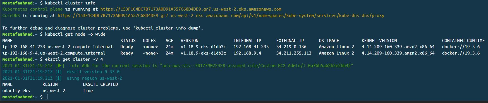

<div align="center">

[](https://app.circleci.com/pipelines/gh/mostafaabdelrahman/udacity-kubernetes-project04)

</div>

# Project 4: Operationalize a Machine Learning Microservice API

## Project Overview

In this project, you will apply the skills you have acquired in this course to operationalize a Machine Learning Microservice API. 

You are given a pre-trained, `sklearn` model that has been trained to predict housing prices in Boston according to several features, such as average rooms in a home and data about highway access, teacher-to-pupil ratios, and so on. You can read more about the data, which was initially taken from Kaggle, on [the data source site](https://www.kaggle.com/c/boston-housing). This project tests your ability to operationalize a Python flask app—in a provided file, `app.py`—that serves out predictions (inference) about housing prices through API calls. This project could be extended to any pre-trained machine learning model, such as those for image recognition and data labeling.

---

## Project Instructions

### Run `app.py` locally

* Create a virtualenv and activate it
* Run `make install` to install the necessary dependencies
* Run `make lint` to lint `app.py` and `Dockerfile`
* Run using python: `python app.py`

### Containerize `app.py`

1. Make docker image, then run it: `./run_docker.sh`
2. Upload docker image to DockerHub: `./upload_docker.sh`
3. Run in Kubernetes: `./run_kubernetes.sh`

### Making prediction
* While running `./run_docker.sh` script: In another terminal run `make_predictions.sh` to make house price predictions (output saved to `docker_out.txt`)
* While running `./run_kubernetes.sh` script: In another terminal run `make_predictions.sh` to make house price predictions (output saved to `kubernetes_out.txt`)

---

## Bonus:

### Make the kubernetes deployment work on multiple cloud platforms: i.e. GCP, AWS, and Azure.

* Created a deployment yaml file `udacity-prediction-app.yaml` for the application

* Created a setup script `run_kubernetes_deployment.sh` to apply the deployment

* Created EKS cluster on AWS using below command:
```
eksctl create cluster --name udacity-eks --region us-west-2  --zones=us-west-2a,us-west-2b \
--nodegroup-name worker-nodes --node-type t2.micro --nodes 2 --nodes-min 2 --nodes-max 2 \
--ssh-access --ssh-public-key webapp-key
```
* Screenshot of EKS cluster:



### Record a demo video that shows the scale up and scale down characteristics of the kubernetes application.

* File ['kubernetes-deployment-scaling.mp4'](kubernetes-deployment-scaling.mp4) is a demo for scaling up and down the application.

---

## Repository files description

1. `app.py`             : flask python app to predict housing prices in Boston
1. `requirements.txt`   : Python requirements module list for app.py
1. `Makefile`           : Makefile that used to build depencies and linting
1. `make_prediction.sh` : shell script to send predition request to flask app
1. `run_docker.sh`      : shell script to build and run docker container for app.py
1. `upload_docker.sh`   : shell script to upload docker image to DockerHub
1. `run_kubernetes.sh`  : shell script to deploy docker image to Kubernetes cluster
1. `Dockerfile`         : Dockerfile to build our docker image for app.py
1. `.circleci/config.yml` : CircleCI configuration file
1. `output_txt_files`   :
        
    directory contains :

    * `docker_out.txt`      : logging of running docker container when we executed `make_prediction.sh`

    * `kubernetes_out.txt`  : logging of running Kubernetes deployment when we executed `make_prediction.sh`

Bonus
1. `udacity-prediction-app.yaml` : Kubernetes deployment file
1. `run_kubernetes_deployment.sh`           : Apply kuberneted deployment and expose service
1. `kubernetes-deployment-scaling.mp4`      : Demo for Kubeneted scaling
